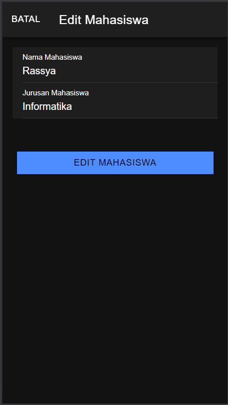
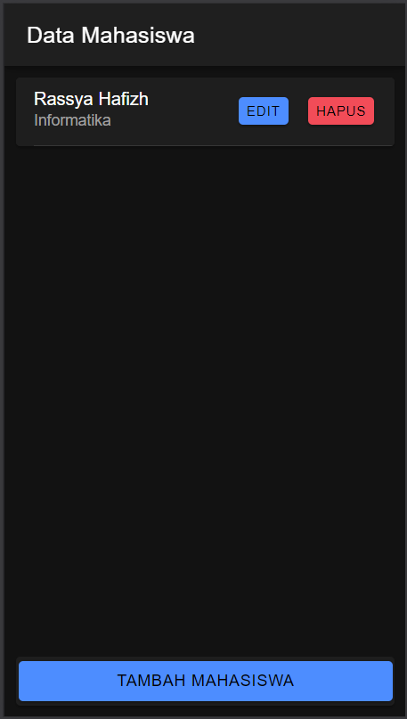

# LabMobile9_RassyaHafizhS_ShiftA

Nama : Rassya Hafizh Suharjo

NIM : H1D022068

## API
1. Menambahkan modul 'provideHttpClient' pada app.module.ts untuk menggunakan api.
```ts
import { NgModule } from '@angular/core';
import { BrowserModule } from '@angular/platform-browser';
import { RouteReuseStrategy } from '@angular/router';

import { IonicModule, IonicRouteStrategy } from '@ionic/angular';

import { AppComponent } from './app.component';
import { AppRoutingModule } from './app-routing.module';
import { provideHttpClient } from '@angular/common/http';

@NgModule({
  declarations: [AppComponent],
  imports: [BrowserModule, IonicModule.forRoot(), AppRoutingModule],
  providers: [{ provide: RouteReuseStrategy, useClass: IonicRouteStrategy }, provideHttpClient()],
  bootstrap: [AppComponent],
})
export class AppModule { }
```

2. Menyambungkan API yakni pada localhost/mahasiswa. Dalam source code pada api.service.ts terdapat method - method yang memanggil method http dari ngmodul http yakni tambah, edit, tampil, hapus, lihat. Method tambah menggunakan http.post, edit menggunakan http.put, tampil menggunakan http.get, hapus menggunakan http.delete, dan lihat menggunakan http.get. Method -method tersebut nantinya akan berguna saat operasi CRUD.

## Halaman Home

Halaman Home pada aplikasi ini diganti ke module mahasiswa dengan routing dari app-routing.module.ts sehingga folder home dapat dihapus karena sudah tidak terpakai lagi

```ts
import { NgModule } from '@angular/core';
import { PreloadAllModules, RouterModule, Routes } from '@angular/router';

const routes: Routes = [
  {
    path: '',
    redirectTo: 'mahasiswa',
    pathMatch: 'full'
  },
  {
    path: 'mahasiswa',
    loadChildren: () => import('./mahasiswa/mahasiswa.module').then(m => m.MahasiswaPageModule)
  },
];

@NgModule({
  imports: [
    RouterModule.forRoot(routes, { preloadingStrategy: PreloadAllModules })
  ],
  exports: [RouterModule]
})
export class AppRoutingModule { }
```

2. Halaman home menampilkan data mahasiswa yaitu nama dan jurusan dengan mengambil data dari API database yang terhubung. Data berada dalam <ion-card> yang di samping nya ada button aksi untuk menghapus dan mengedit data yang ada pada card tersebut. Data diidentifikasi berdasarkan kolom id yang terkirim bila menekan salah satu button tersebut. Di bawah card data terdapat button yang mengarahkan untuk tambah data mahasiswa. Button ini tidak seperti yang lain yang mengirim id data.


```html
<ion-header [translucent]="true">
  <ion-toolbar>
    <ion-title>Data Mahasiswa</ion-title>
  </ion-toolbar>
</ion-header>

<ion-content [fullscreen]="true">
  <ion-header collapse="condense">
    <ion-toolbar>
      <ion-title size="large">Data Mahasiswa</ion-title>
    </ion-toolbar>
  </ion-header>

  <ion-card *ngFor="let item of dataMahasiswa">
    <ion-item>
      <ion-label>
        {{item.nama}}
        <p>{{item.jurusan}}</p>
      </ion-label>
      <ion-button color="danger" slot="end" (click)="alertHapusMhs(item.id)">Hapus</ion-button>
      <ion-button expand="block" (click)="openModalEdit(true,item.id)">Edit</ion-button>
    </ion-item>
  </ion-card>
</ion-content>


<!-- button tambah -->
<ion-card>
  <ion-button (click)="openModalTambah(true)" expand="block">Tambah Mahasiswa</ion-button>
</ion-card>
```

## Tambah Data

1. Halaman tambah data dapat diakses dengan menekan button tambah pada ujung bawah halaman home meski masih berada dalam souce code yang sama yakni mahasiswa.page.html. Menekan button tambah mahasiswa akan memanggil method OpenModalTambah dan memasukkan parameter true ke dalamnya. Pada method tersebut jika isOpen = true maka ModalTambah menjadi true yang artinya memunculkan halaman modal tambah dan ModalEdit menjadi false supaya tidak masuk ke halaman edit.

```html
<!-- button tambah -->
<ion-card>
  <ion-button (click)="openModalTambah(true)" expand="block">Tambah Mahasiswa</ion-button>
</ion-card>
```

pada mahasiswa.page.ts
```ts
openModalTambah(isOpen: boolean) {
    this.modalTambah = isOpen;
    this.resetModal();
    this.modalTambah = true;
    this.modalEdit = false;
  }
```

yang kemudian memunculkan halaman modalTambah
```html
<!-- modal tambah -->
<ion-modal [isOpen]="modalTambah">
  <ng-template>
    <ion-header>
      <ion-toolbar>
        <ion-buttons slot="start">
          <ion-button (click)="cancel()">Batal</ion-button>
        </ion-buttons>
        <ion-title>Tambah Mahasiswa</ion-title>
      </ion-toolbar>
    </ion-header>
    <ion-content class="ion-padding">
      <ion-item>
        <ion-input label="Nama Mahasiswa" labelPlacement="floating" required [(ngModel)]="nama"
          placeholder="Masukkan Nama Mahasiswa" type="text">
        </ion-input>
      </ion-item>
      <ion-item>
        <ion-input label='Jurusan Mahasiswa' labelPlacement="floating" required [(ngModel)]="jurusan"
          placeholder="Masukkan Jurusan Mahasiswa" type="text">
        </ion-input>
      </ion-item>
      <ion-row>
        <ion-col>
          <ion-button type="button" (click)="tambahMahasiswa()" color="primary" shape="full" expand="block">Tambah
            Mahasiswa
          </ion-button>
        </ion-col>
      </ion-row>
    </ion-content>
  </ng-template>
</ion-modal>
```


Pada halaman tersebut terdapat button tambah mahasiswa yang akan memanggil method tambahMahasiswa()
```ts
//tambah data
  tambahMahasiswa() {
    if (this.nama != '' && this.jurusan != '') {
      let data = {
        nama: this.nama,
        jurusan: this.jurusan,
      }
      this.api.tambah(data, 'tambah.php')
        .subscribe({
          next: (hasil: any) => {
            this.resetModal();
            console.log('berhasil tambah mahasiswa');
            this.getMahasiswa();
            this.modalTambah = false;
            this.modal.dismiss();
          },
          error: (err: any) => {
            console.log('gagal tambah mahasiswa');
          }
        })
    } else {
      console.log('gagal tambah mahasiswa karena masih ada data yg kosong');
    }
  }
```

Pada method tambahMahasiswa() akan memeriksa apakah semua data sudah terisi. Jika sudah maka data akan diambil dalam variabel let data. data yang diambil adalah input nim dan jurusan. Setelah itu dilakukan insert data melalui method tambah dari api.service.ts. Kemudian memanggil method resetModal() untuk menullkan variabel nama dan jurusan. Memanggil method getMahasiswa untuk mengambil data yang telah diinputkan ke database. Terakhir, mengubah modalTambah menjadi false untuk menutup modal tambah dan kembali ke halaman home.

Jika ingin batal menambahkan data terdapat button batal yang memanggil method cancel
```ts
cancel() {
    this.modal.dismiss();
    this.modalTambah = false;
    this.modalEdit = false;
    this.resetModal();
  }
```

resetModal untuk mengosongkan nilai pada id, nama, dan jurusan
```ts
resetModal() {
    this.id = null;
    this.nama = '';
    this.jurusan = '';
  }
```


## Tampil Data

1. Tampil data dapat muncul ketika modalTambah dan modalEdit dalam keadaan false.


2. Halaman tampil data merupakan tampilan home. Data ditampilkan dengan mengambil dari database menggunakan method getMahasiswa. Method ini berhubungan dengan api melalui method get yanga ada di api.service.ts. Oleh karena halaman ini merupakan halaman home, maka method getMahasiswa merupakan method yang diinisiasi pertama kali melalui method ngOnInit().

```ts
ngOnInit() {
    this.getMahasiswa();
  }

  getMahasiswa() {
    this.api.tampil('tampil.php').subscribe({
      next: (res: any) => {
        console.log('sukses', res);
        this.dataMahasiswa = res;
      },
      error: (err: any) => {
        console.log(err);
      },
    });
  }
```
3. Data - data yang diambil tersebut kemudian dimasukkan dalam card.
```html
 <ion-card *ngFor="let item of dataMahasiswa">
    <ion-item>
      <ion-label>
        {{item.nama}}
        <p>{{item.jurusan}}</p>
      </ion-label>
      <ion-button color="danger" slot="end" (click)="alertHapusMhs(item.id)">Hapus</ion-button>
      <ion-button expand="block" (click)="openModalEdit(true,item.id)">Edit</ion-button>
    </ion-item>
  </ion-card>
```

## Edit Data

1. Edit data hampir sama dengan modal tambah data perbedaanya pada edit data mengambil data id dari data yang telah ada sebelumnya.
```html
<ion-button expand="block" (click)="openModalEdit(true,item.id)">Edit</ion-button>
```
Data spesifik diambil menggunakan method ambilMahasiswa yang menyambung ke API lihat.php dan menggunakan method lihat dari api.service.ts yang melakukan select data berdasarkan id item yang diambil.
```ts
//Ambil data untuk update
  ambilMahasiswa(id: any) {
    this.api.lihat(id,
      'lihat.php?id=').subscribe({
        next: (hasil: any) => {
          console.log('sukses', hasil);
          let mahasiswa = hasil;
          this.id = mahasiswa.id;
          this.nama = mahasiswa.nama;
          this.jurusan = mahasiswa.jurusan;
        },
        error: (error: any) => {
          console.log('gagal ambil data');
        }
      })
  }
```

button edit juga mengubah modalEdit menjadi true seperti pada modaltambah
```ts
openModalEdit(isOpen: boolean, idget: any) {
    this.modalEdit = isOpen;
    this.id = idget;
    console.log(this.id);
    this.ambilMahasiswa(this.id);
    this.modalTambah = false;
    this.modalEdit = true;
  }
```

Jika modalEdit true maka akan membuka halaman modal edit. Pada halaman edit form akan otomatis terisi oleh data yang diambil dari this.ambilMahasiswa(this.id);
```html
<!-- ini untuk modal edit -->
<ion-modal [isOpen]="modalEdit">
  <ng-template>
    <ion-header>
      <ion-toolbar>
        <ion-buttons slot="start">
          <ion-button (click)="cancel()">Batal</ion-button>
        </ion-buttons>
        <ion-title>Edit Mahasiswa</ion-title>
      </ion-toolbar>
    </ion-header>
    <ion-content class="ion-padding">
      <ion-item>
        <ion-input label="Nama Mahasiswa" labelPlacement="floating" required [(ngModel)]="nama"
          placeholder="Masukkan Nama Mahasiswa" type="text">
        </ion-input>
      </ion-item>
      <ion-item>
        <ion-input label='Jurusan Mahasiswa' labelPlacement="floating" required [(ngModel)]="jurusan"
          placeholder="Masukkan Jurusan Mahasiswa" type="text">
        </ion-input>
      </ion-item>
      <ion-input required [(ngModel)]="id" type="hidden">
      </ion-input>
      <ion-row>
        <ion-col>
          <ion-button type="button" (click)="editMahasiswa()" color="primary" shape="full" expand="block">Edit
            Mahasiswa
          </ion-button>
        </ion-col>
      </ion-row>
    </ion-content>
  </ng-template>
</ion-modal>
```

Pada saat menekan button edit data akan memanggil method editMahasiswa. Method ini melakukan update data dengan koneksi api.service.ts melalui method edit.
```ts
//update data
  editMahasiswa() {
    let data = {
      id: this.id,
      nama: this.nama,
      jurusan: this.jurusan
    }
    this.api.edit(data, 'edit.php')
      .subscribe({
        next: (hasil: any) => {
          console.log(hasil);
          this.resetModal();
          this.getMahasiswa();
          console.log('berhasil edit Mahasiswa');
          this.modalEdit = false;
          this.modal.dismiss();
        },
        error: (err: any) => {
          console.log('gagal edit Mahasiswa');
        }
      })
  }
```
Method editMahasiswa melakukan prosedur yang hampir sama dengan tambahMahasiswa. Perbedaannya terletak pada modalEdit yang diganti ke false dan url api yang digunakan.




## Hapus Data
Hapus data terjadi ketika menekan button hapus pada salah satu card di home. Data dihapus berdasarkan id data dari card yang ditekan button hapusnya.
```html
<ion-button color="danger" slot="end" (click)="alertHapusMhs(item.id)">Hapus</ion-button>
```
Pada kode tersebut button hapus akan memanggil alert dari method alertHapusMhs() yang akan melakukan konfirmasi apakah data ingin dihapus atau tidak. Jika tekan hapus pada alert alertHapusMhs maka akan memanggil method hapusMahasiswa() yang menghapus data. Jika klik batal maka kembali ke halaman home dan data dibiarkan.
```ts
async alertHapusMhs(id: any) {
    const alert = await this.alertController.create({
      header: 'Hapus data',
      message: 'Apakah Anda yakin untuk menghapus data mahasiswa bersangkutan?',
      buttons: [
        {
          text: 'Batal',
          role: 'cancel',
          handler: () => {
            console.log('Penghapusan dibatalkan');
          }
        },
        {
          text: 'Hapus',
          role: 'destructive',
          handler: () => {
            this.hapusMahasiswa(id);
          }
        }
      ]
    });
```

Pada method hapusMahasiswa id digunakan sebagai parameter mana data yang akan dihapus. Method hapus dari api.service.ts digunakan untuk menghapus data di database. Jika hapus data berhasil akan kembali ke page home dengan getMahasiswa().
```ts
//hapus data
  hapusMahasiswa(id: any) {
    this.api.hapus(id,
      'hapus.php?id=').subscribe({
        next: (res: any) => {
          console.log('sukses', res);
          this.getMahasiswa();
          console.log('berhasil hapus data');
        },
        error: (error: any) => {
          console.log('gagal');
        }
      })
  }
```



