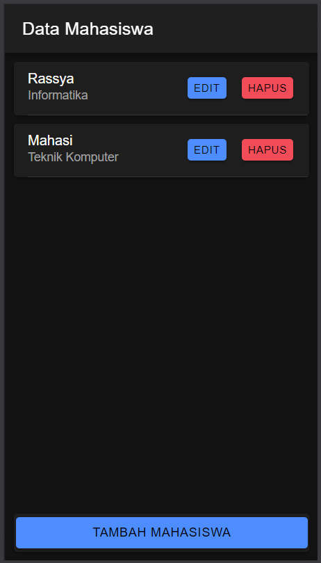
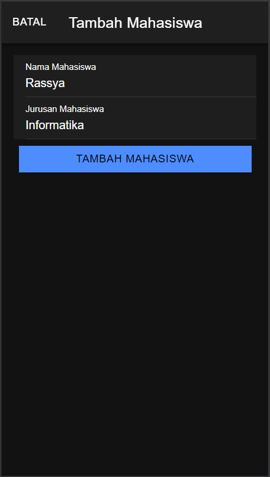

# LabMobile9_RassyaHafizhS_ShiftA

Nama : Rassya Hafizh Suharjo

NIM : H1D022068

## API
1. Menambahkan modul 'provideHttpClient' pada app.module.ts untuk menggunakan api.
```ts
import { NgModule } from '@angular/core';
import { BrowserModule } from '@angular/platform-browser';
import { RouteReuseStrategy } from '@angular/router';

import { IonicModule, IonicRouteStrategy } from '@ionic/angular';

import { AppComponent } from './app.component';
import { AppRoutingModule } from './app-routing.module';
import { provideHttpClient } from '@angular/common/http';

@NgModule({
  declarations: [AppComponent],
  imports: [BrowserModule, IonicModule.forRoot(), AppRoutingModule],
  providers: [{ provide: RouteReuseStrategy, useClass: IonicRouteStrategy }, provideHttpClient()],
  bootstrap: [AppComponent],
})
export class AppModule { }
```

2. Menyambungkan API yakni pada localhost/mahasiswa. Dalam source code pada api.service.ts terdapat method - method yang memanggil method http dari ngmodul http yakni tambah, edit, tampil, hapus, lihat. Method tambah menggunakan http.post, edit menggunakan http.put, tampil menggunakan http.get, hapus menggunakan http.delete, dan lihat menggunakan http.get. Method -method tersebut nantinya akan berguna saat operasi CRUD.

## Halaman Home

Halaman Home pada aplikasi ini diganti ke module mahasiswa dengan routing dari app-routing.module.ts sehingga folder home dapat dihapus karena sudah tidak terpakai lagi

```ts
import { NgModule } from '@angular/core';
import { PreloadAllModules, RouterModule, Routes } from '@angular/router';

const routes: Routes = [
  {
    path: '',
    redirectTo: 'mahasiswa',
    pathMatch: 'full'
  },
  {
    path: 'mahasiswa',
    loadChildren: () => import('./mahasiswa/mahasiswa.module').then(m => m.MahasiswaPageModule)
  },
];

@NgModule({
  imports: [
    RouterModule.forRoot(routes, { preloadingStrategy: PreloadAllModules })
  ],
  exports: [RouterModule]
})
export class AppRoutingModule { }
```

2. Halaman home menampilkan data mahasiswa yaitu nama dan jurusan dengan mengambil data dari API database yang terhubung. Data berada dalam <ion-card> yang di samping nya ada button aksi untuk menghapus dan mengedit data yang ada pada card tersebut. Data diidentifikasi berdasarkan kolom id yang terkirim bila menekan salah satu button tersebut. Di bawah card data terdapat button yang mengarahkan untuk tambah data mahasiswa. Button ini tidak seperti yang lain yang mengirim id data.



```html
<ion-header [translucent]="true">
  <ion-toolbar>
    <ion-title>Data Mahasiswa</ion-title>
  </ion-toolbar>
</ion-header>

<ion-content [fullscreen]="true">
  <ion-header collapse="condense">
    <ion-toolbar>
      <ion-title size="large">Data Mahasiswa</ion-title>
    </ion-toolbar>
  </ion-header>

  <ion-card *ngFor="let item of dataMahasiswa">
    <ion-item>
      <ion-label>
        {{item.nama}}
        <p>{{item.jurusan}}</p>
      </ion-label>
      <ion-button color="danger" slot="end" (click)="alertHapusMhs(item.id)">Hapus</ion-button>
      <ion-button expand="block" (click)="openModalEdit(true,item.id)">Edit</ion-button>
    </ion-item>
  </ion-card>
</ion-content>


<!-- button tambah -->
<ion-card>
  <ion-button (click)="openModalTambah(true)" expand="block">Tambah Mahasiswa</ion-button>
</ion-card>
```

## Tambah Data

1. Halaman tambah data dapat diakses dengan menekan button tambah pada ujung bawah halaman home meski masih berada dalam souce code yang sama yakni mahasiswa.page.html. Menekan button tambah mahasiswa akan memanggil method OpenModalTambah dan memasukkan parameter true ke dalamnya. Pada method tersebut jika isOpen = true maka ModalTambah menjadi true yang artinya memunculkan halaman modal tambah dan ModalEdit menjadi false supaya tidak masuk ke halaman edit.

```html
<!-- button tambah -->
<ion-card>
  <ion-button (click)="openModalTambah(true)" expand="block">Tambah Mahasiswa</ion-button>
</ion-card>
```

pada mahasiswa.page.ts
```ts
openModalTambah(isOpen: boolean) {
    this.modalTambah = isOpen;
    this.resetModal();
    this.modalTambah = true;
    this.modalEdit = false;
  }
```

yang kemudian memunculkan halaman modalTambah
```html
<!-- modal tambah -->
<ion-modal [isOpen]="modalTambah">
  <ng-template>
    <ion-header>
      <ion-toolbar>
        <ion-buttons slot="start">
          <ion-button (click)="cancel()">Batal</ion-button>
        </ion-buttons>
        <ion-title>Tambah Mahasiswa</ion-title>
      </ion-toolbar>
    </ion-header>
    <ion-content class="ion-padding">
      <ion-item>
        <ion-input label="Nama Mahasiswa" labelPlacement="floating" required [(ngModel)]="nama"
          placeholder="Masukkan Nama Mahasiswa" type="text">
        </ion-input>
      </ion-item>
      <ion-item>
        <ion-input label='Jurusan Mahasiswa' labelPlacement="floating" required [(ngModel)]="jurusan"
          placeholder="Masukkan Jurusan Mahasiswa" type="text">
        </ion-input>
      </ion-item>
      <ion-row>
        <ion-col>
          <ion-button type="button" (click)="tambahMahasiswa()" color="primary" shape="full" expand="block">Tambah
            Mahasiswa
          </ion-button>
        </ion-col>
      </ion-row>
    </ion-content>
  </ng-template>
</ion-modal>
```


Pada halaman tersebut terdapat button tambah mahasiswa yang akan memanggil method tambahMahasiswa()
```ts
//tambah data
  tambahMahasiswa() {
    if (this.nama != '' && this.jurusan != '') {
      let data = {
        nama: this.nama,
        jurusan: this.jurusan,
      }
      this.api.tambah(data, 'tambah.php')
        .subscribe({
          next: (hasil: any) => {
            this.resetModal();
            console.log('berhasil tambah mahasiswa');
            this.getMahasiswa();
            this.modalTambah = false;
            this.modal.dismiss();
          },
          error: (err: any) => {
            console.log('gagal tambah mahasiswa');
          }
        })
    } else {
      console.log('gagal tambah mahasiswa karena masih ada data yg kosong');
    }
  }
```

Pada method tersebut akan memeriksa apakah semua data sudah terisi. Jika sudah maka data akan diambil dalam variabel let data. data yang diambil adalah input nim dan jurusan. Setelah itu dilakukan insert data melalui api. Kemudian memanggil method resetModal() untuk menullkan variabel nama dan jurusan. Memanggil method getMahasiswa untuk mengambil data yang telah diinputkan ke database. Terakhir, mengubah modalTambah menjadi false untuk menutup modal tambah dan kembali ke halaman home.



## Tampil Data
